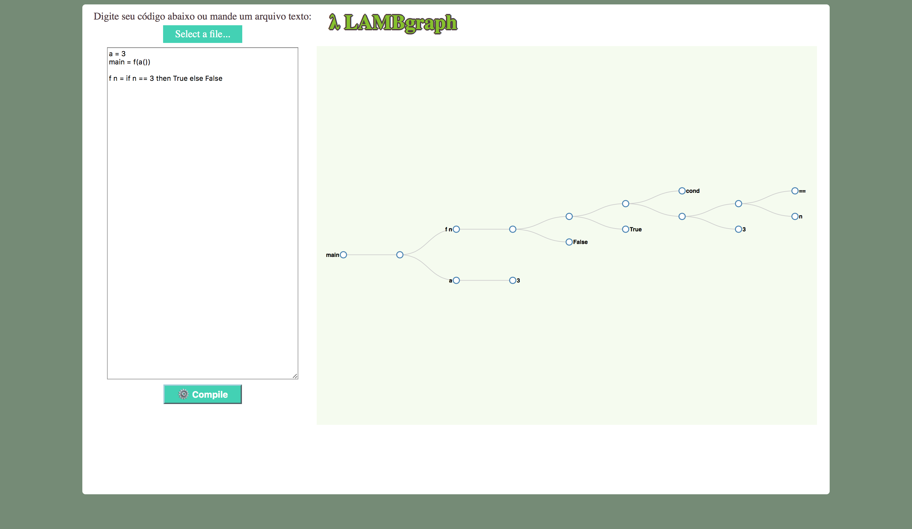
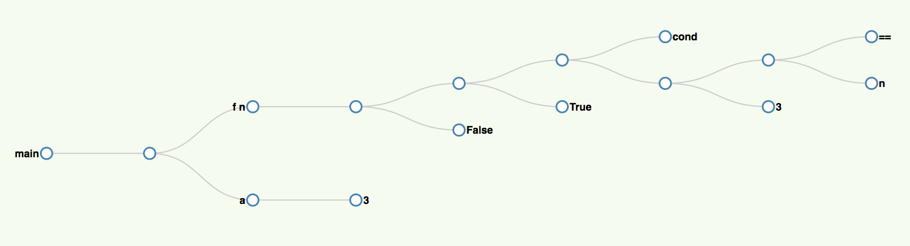

# Projeto 1

## Grupo 2:

|                  Nome                 |   RA   |
|:-------------------------------------:|:------:|
|             Eric Krakauer             | 155253 |
| José Pedro Vieira do Nascimento Filho | 155981 |
|           Lucas Alves Racoci          | 156331 |
|   Luiz Fernando Rodrigues da Fonseca  | 156475 |
|          Rafael Gois Pimenta          | 157055 |

## Resumo

A primeira etapa do projeto foi implementar uma aplicação que recebe como entrada um código em uma linguagem funcional criada pelo grupo, converte para uma representação intermediária em formato de árvore baseada na notação lambda, e mostra na tela o código em formato de árvore. O projeto foi dividido em duas camadas: um cliente web em JavaScript (com auxílio de AngularJS e D3JS) que recebe o código na linguagem funcional e mostra a imagem do código na tela, enquanto o servidor feito em Python (com auxílio de PLY), faz as análises léxica e sintática, transformando o código funcional em árvore, e devolve um JSON que o cliente web processa para mostrar as informações na tela. A comunicação entre as duas camadas foi feita através de uma REST implementada com o auxílio do Flask.

## Execução do Projeto

Para rodar o projeto, vá na pasta *src*, digite o comando abaixo no terminal e depois entre em **localhost:8080**:

```
python rest.py
```

Dentro do navegador web, é possível digitar um código dentro da caixa de texto, ou escolher um arquivo com código que para ser colocado na caixa de texto. Então, apenas clique em *Submit* para enviar o código para o servidor e mostrar a árvore na tela. A figura abaixo mostra um exemplo.



## Linguagem

Abaixo está um exemplo do código na linguagem:

```
isZero a = a == 0

fact n = if isZero(n) then 1 else fact(n - 1) * n

main = fact(3)
```

O começo do programa sempre é uma função main sem argumentos. Nela são definidos valores que simulariam uma entrada de dados no programa. A linguagem aceita números inteiros (positivos, negativos e zero), booleanos (*True* e *False*) e funções. As definições e chamadas de funções são feitas como mostrado abaixo:

```
sum a b = a + b

main = sum(3)(4)
```

A linguagem aceita expressões aritméticas (+,-,*,/), comparações (==, <=, >=, <, >) e expressões booleanas (and, ior, xor, !). Também são aceitos parênteses nas expressões. Existe também uma estrutura condicional de if-then-else mostrada abaixo:

```
compare a b = if a > b then a else b
```

São feitas algumas checagens de erros na linguagem como por exemplo:

- Checar nas funções se não existem variáveis que não foram inicializadas.
- Checar se existe uma função *main* sem argumentos.
- Checar se as funções chamadas existem.

## Representação em Árvore

Foi construída uma representação intermediária em formato de árvore baseada no cálculo lambda. Cada nó não folha da árvore representa uma aplicação do filho superior tendo o filho inferior como argumento. Exceto quando se está definindo uma função, nesse caso, o nó contém os argumentos da função na ordem em que serão "consumidos" quando a função for aplicada. Assim, é como se todas as funções recebessem um único argumento e retornassem ou uma função, ou um valor. Um exemplo de árvore está abaixo:



Na árvore, são mostradas as chamadas de funções do programa, exceto no caso de recursões, em que é mostrada a árvore da recursão apenas uma vez. Nas próximas etapas, na parte de execução do código, a recursão será expandida várias vezes para mostrar efetivamente os valores das variáveis na execução do programa.

Para chegar nesta representação, primeiramente é utilizado um parser para construir a árvore de execução de cada função. Além da árvore de execução de cada função, ele retorna um mapa de dependências entre funções, e dicionários de nomes (argumentos) das funções. Depois, outro módulo cria uma árvore unificada de funções, inicializando pela função *main*. Não é possível fazer tudo em um único passo, pois no parser quando estamos em uma chamada de função, pode ser que a árvore da função chamada ainda não seja conhecida, pois ela está declarada depois, e o parser ainda não teria montado a árvore da função chamada.

## Cliente Web

O cliente web e o servidor se comunicam através de uma REST implementada com o auxílio do Flask. No cliente web, é utilizado AngularJS para fazer a chamada a REST, enviando um JSON com o programa na linguagem funcional. O servidor responde com outro JSON que representa a árvore da linguagem funcional. Essa árvore é mostrada na tela através da biblioteca D3JS.

## Docker

Foi criada uma imagem em uma branch separada para realizar testes no programa. Foram feitos testes do lexer e do parser, que retornavam árvores para cada função, dicionário de nomes e dependências de cada função, comparando a resposta com um JSON. Também foram feitos testes na parte de conversão da saída do parser para a árvore que seria mostrada na tela, também comparando JSONs. Por fim, foram feitos testes unitários no AngularJS com o auxílio do Karma.

